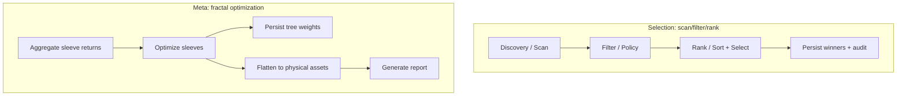

# Audit Findings → Concrete Acceptance Criteria (Extracted)

This note extracts **testable acceptance criteria** from existing audit plans/reports so we can reuse them as success criteria for any new “fractal optimization / MLOps pipeline” work.

## Meta-Portfolio Validation: Plan vs. Results

Sources:
- Plan: `docs/plan/audit_meta_portfolio_validation_20260117.md` (dated 2026-01-17)
- Results: `docs/reports/fractal_meta_audit_20260118.md` (dated 2026-01-18)

### Acceptance Criteria (Meta Layer)

1) **Inputs exist and are healthy**
- For a given meta profile, all referenced sleeves have valid return streams available for target risk profiles (or documented fallback behavior is triggered).
- Sleeves with “health below threshold” are vetoed (current code uses `validate_sleeve_health(..., threshold=0.75)`).

2) **Meta allocation runs and is auditable**
- The meta optimizer identifies the expected number of sleeves (e.g., 4 for `meta_crypto_only`).
- The audit ledger contains intent/outcome events for meta optimization steps (e.g., `meta_optimize_hrp`) when audit is enabled.

3) **Tree persistence exists (fractal transparency)**
- For each optimized risk profile, an uncollapsed tree artifact exists:
  - `meta_cluster_tree_<meta_profile>_<risk_profile>.json`

4) **Flattening produces a valid implementation target**
- The “final output” is a list of **physical symbols only** (no logic atoms).
- Assets appearing in multiple sleeves have weights **summed** correctly.
- A net directional weight is preserved if long/short sleeves contribute to the same physical asset.

5) **Workspace isolation is enforced**
- All meta artifacts are namespaced/prefixed by meta profile and/or run id to prevent collisions between runs or between meta profiles.

### Operational Acceptance Criteria (Reportability)

6) **Forensic report is generated**
- A markdown report is produced for the run:
  - `.../reports/meta_portfolio_report.md`
- It includes at minimum:
  - sleeve allocation table,
  - (if available) cluster tree,
  - consolidated top assets,
  - basic performance metrics for the meta returns stream.

## Manifest-Driven Ranking (Selection Layer)

Source: `docs/plan/manifest_driven_ranking_20260116.md` (dated 2026-01-16)

### Acceptance Criteria (Ranking as Config)

1) Ranking direction is profile-configurable in `configs/manifest.json`:
- Long profiles sort conviction descending by default.
- Short profiles can explicitly sort ascending.

2) The selection policy reads ranking config (no hardcoded direction).

3) The schema validates the new ranking fields (manifest schema updated).

## Mermaid: Where Acceptance Criteria Attach

## Notes: What This Enables for Next Work

- We can reuse the above as “done means done” criteria:
  - New fractal constructs must still preserve physical-asset collapse, audit tree persistence, and deterministic artifact naming.
  - New ranking/selection pipeline changes must remain manifest-driven and schema-validated.

