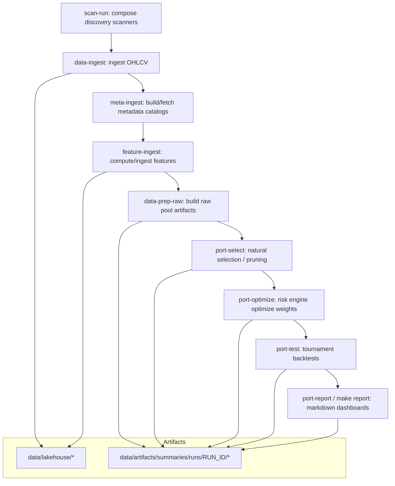
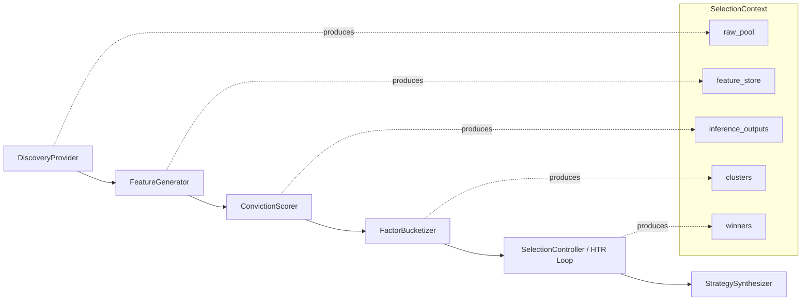
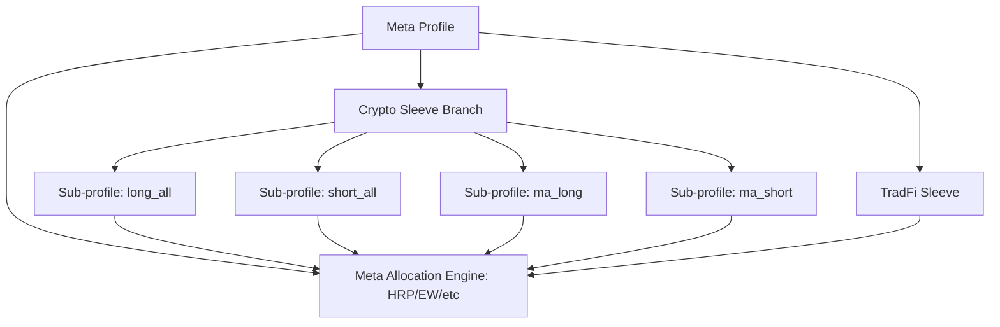

# Current Architecture (Local-Only Summary)

This document summarizes the **current** (already-implemented) pipeline architecture as described by repo docs and by the `Makefile` orchestration targets.

## System Topology (High Level)

At a high level the repo expresses a deterministic, manifest-driven pipeline:

1. **Discovery**: scan/compose candidate universes (L0–L4).
2. **DataOps**: ingest OHLCV + metadata + features into a “lakehouse”.
3. **Selection**: prune/select candidates into a winners set.
4. **Risk/Allocation**: compute portfolio weights with cluster-aware constraints.
5. **Backtesting/Tournament**: validate strategies across engines/simulators.
6. **Reporting / Audit**: persist artifacts, summaries, and decision trails.

Key orchestration lives in:
- `Makefile` targets (namespaced: `scan-*`, `flow-*`, `data-*`, `port-*`)
- `configs/manifest.json` profiles and defaults

## Mermaid: Core Pipeline Flow

## Artifact Contracts (Observed in Makefile)

The Makefile defines canonical “run scoped” artifact paths, including:

- Candidate lists
  - Raw candidates: `data/artifacts/summaries/runs/<RUN_ID>/data/portfolio_candidates_raw.json`
  - Selected candidates: `data/artifacts/summaries/runs/<RUN_ID>/data/portfolio_candidates.json`
- Returns matrix: `data/artifacts/summaries/runs/<RUN_ID>/data/returns_matrix.parquet`
- Portfolio metadata: `data/artifacts/summaries/runs/<RUN_ID>/data/portfolio_meta.json`
- Selection audit: `data/artifacts/summaries/runs/<RUN_ID>/data/selection_audit.json`
- Cluster output: `data/artifacts/summaries/runs/<RUN_ID>/data/portfolio_clusters.json`

These match the repo’s emphasis on:
- Reproducibility via immutable run IDs
- Auditability and ledgering

## Selection Pipeline Decomposition (v4 / MLOps-Centric)

From `docs/design/selection_pipeline_v4_mlops.md`, selection is modeled as a stage pipeline:

- Ingestion (discovery provider)
- Feature engineering (feature generator)
- Inference (conviction scorer)
- Partitioning (factor bucketizer / clustering)
- Policy (HTR loop and recruitment)
- Synthesis (strategy atom manifest)

This maps cleanly to the “scan/filter/rank” phrasing in the rough idea:
- Scan ≈ Discovery/Ingestion
- Filter ≈ Policy + hygiene gates
- Rank ≈ Inference scoring + ranking + selection controller decisions

## Mermaid: v4 Selection Stages

## “Fractal” / Meta-Portfolio Architecture (Already Represented)

The manifest includes “meta profiles” that define **multi-sleeve** portfolios.

Example: `configs/manifest.json` contains `meta_fractal_test`:
- A `crypto_branch` sleeve referencing `meta_crypto_only`
- A `tradfi_sleeve` referencing `institutional_etf`
- A meta allocation profile (e.g., `equal_weight`)

### Mermaid: Meta-Portfolio Composition

## Observed Design Constraints That Matter for “Fractal Optimization”

From `AGENTS.md` and related docs:

- “Strategy atoms” are `(Asset, Logic)`; each atom has exactly one logic.
- Shorts are normalized/inverted into “synthetic long” return streams before optimization.
- Meta-allocation treats sleeve outputs (or strategy outputs) as synthetic assets.
- Calendar handling should preserve real trading calendars (no zero-filled weekends for TradFi).
- Audit ledger integrity is treated as non-optional for production decisions.

