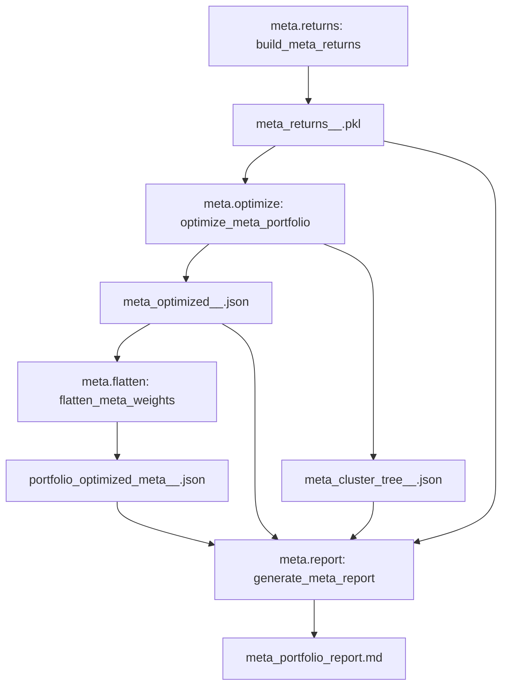

# Fractal / Meta-Portfolio: What Exists Today

This note captures the current “fractal portfolio” implementation as described by the repo spec docs and the actual meta-pipeline scripts.

## Working Definition (“Fractal” in this repo)

“Fractal” means **hierarchical portfolio optimization** where:

- **Atomic sleeves** produce return streams and (optionally) optimized weights for physical assets.
- A **meta layer** treats sleeves themselves as “assets” and allocates across them (HRP/MVO/etc).
- The meta decision is then **flattened** back down into a single physical-asset implementation target.
- This is **recursive**: a sleeve can itself be another `meta_profile`.

## Spec: Fractal Hierarchical Meta-Portfolio (v1)

Source: `docs/specs/fractal_meta_portfolio_v1.md`

Key requirements captured there:

- Recursive nesting: sleeves may reference `meta_profile` and must be resolved recursively.
- Weighted return aggregation: parents aggregate child sleeve return streams; if a child meta optimization fails, fallback to equal-weight proxy.
- Physical asset collapse: final deliverable is **physical symbols only**; any logic atoms are resolved and summed.
- Forensic auditability: preserve uncollapsed “tree” weights (cluster tree) at each meta level.

## Implementation: Meta Pipeline Scripts

The orchestrated meta pipeline exists and is stage-registered:

- `scripts/run_meta_pipeline.py`
  - Executes: `meta.returns` → `meta.optimize` → `meta.flatten` → `meta.report`
  - Uses `QuantSDK.run_stage(...)` which suggests a general pipeline/orchestrator abstraction already exists.
- `scripts/build_meta_returns.py` (`StageRegistry`: `meta.returns`)
  - Recursively builds meta return matrices.
  - Supports nested `meta_profile` sleeves (recursive calls) and can fall back to equal-weight if sub-meta optimization fails.
  - Includes caching keyed by sleeve run IDs (sha256 hash).
  - Includes a health gate (`validate_sleeve_health(..., threshold=0.75)`), vetoing unhealthy sleeves.
- `scripts/optimize_meta_portfolio.py` (`StageRegistry`: `meta.optimize`)
  - Runs a “custom” engine on the meta returns matrix.
  - Persists:
    - `meta_optimized_<meta_profile>_<risk_profile>.json`
    - `meta_cluster_tree_<meta_profile>_<risk_profile>.json` (explicitly the “fractal tree”)
  - Hooks into audit ledger when enabled (`features.feat_audit_ledger`).
- `scripts/flatten_meta_weights.py` (`StageRegistry`: `meta.flatten`)
  - Flattens meta weights to physical assets.
  - Supports recursive flattening for nested meta sleeves by reading sub-meta flattened outputs.
- `scripts/generate_meta_report.py` (`StageRegistry`: `meta.report`)
  - Generates a markdown forensic report with performance metrics, sleeve allocations, cluster trees, and consolidated top assets.

## Mermaid: Meta-Pipeline Data Flow

## Evidence: Forensic Audit Passed (Mechanics)

Source: `docs/reports/fractal_meta_audit_20260118.md` (dated 2026-01-18)

This audit asserts (and the code structure supports) that:

- Recursive optimization is traced via an audit ledger event (`meta_optimize_hrp`).
- Tree persistence is working (`meta_cluster_tree_*` written).
- Atom→physical resolution succeeds and weights are summed across sleeves.
- Artifact namespace isolation is in place (prefixed outputs).

## Implications for the New Rough Idea

If the new initiative is “fractal portfolios optimization with MLOps pipelines to scan, filter, rank…”, then:

- The **fractal/meta optimization** piece already exists as code + spec + audit evidence.
- The next increment is likely:
  - expanding the fractal concept beyond sleeves (e.g., multi-horizon, regime, or logic families), and/or
  - formalizing the earlier scan/filter/rank pipeline stages so they are equally composable, auditable, and manifest-driven.

## Open Gaps / Clarification Targets

- What exactly counts as a “sleeve” for the next iteration:
  - strategy logic (rating_all vs rating_ma),
  - direction (long vs short),
  - horizon (5d/20d/60d),
  - or market (crypto vs tradfi).
- Which layer should own “fractal recursion”:
  - only meta-portfolio layer, or
  - allow recursive composition earlier (selection pipelines producing “virtual sleeves”).

