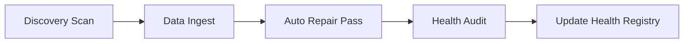

# Design: Data Pipeline Hardening (v1)

## 1. Objective
To transition the DataOps layer to a "Zero-Touch Golden Foundation" model by implementing advanced microstructure validation and automated resilience hooks.

## 2. Advanced Microstructure Validation

### 2.1 `AdvancedToxicityValidator`
A new utility class in `tradingview_scraper/pipelines/selection/base.py` (or a dedicated module) that extends L1 ingestion checks.

#### 2.1.1 Volume Spike Detection
- **Metric**: 1-day volume vs. trailing 20-day average.
- **Veto Condition**: $V_t > \mu_{V, 20} + 10\sigma_{V, 20}$.
- **Rationale**: High volume spikes in otherwise illiquid assets often indicate data errors or "pump" artifacts that corrupt risk engines.

#### 2.1.2 Price Stall Detection
- **Metric**: Consecutive bars with $\Delta P = 0$.
- **Veto Condition**: $> 3$ consecutive bars of zero change for non-stablecoin assets.
- **Rationale**: Stalled prices indicate "zombie" assets or broken exchange feeds.

## 3. Automated Foundation Lifecycle

### 3.1 Integrated Repair Pass
The `flow-data` lifecycle in the `Makefile` will be updated to ensure `data-repair` is not an optional maintenance task but a mandatory gate.



### 3.2 `FoundationHealthRegistry`
A persistent ledger stored at `data/lakehouse/foundation_health.json`.

**Schema**:
```json
{
  "BINANCE:BTCUSDT": {
    "status": "healthy",
    "last_repair": "2026-01-22T12:00:00",
    "audit_hash": "a1b2c3d4",
    "gaps_filled": 2,
    "is_toxic": false
  }
}
```

## 4. Ingestion Service Enhancements
- **Pre-Ingest**: Check `foundation_health.json`. If an asset is marked as `toxic`, skip ingestion unless `FORCE=1`.
- **Post-Ingest**: Automatically calculate microstructure metrics and update the registry.

## 5. Implementation Roadmap
1. Build `AdvancedToxicityValidator`.
2. Implement `FoundationHealthRegistry` manager.
3. Update `scripts/services/ingest_data.py` to use the new validator and registry.
4. Update `Makefile` to chain `data-repair`.
