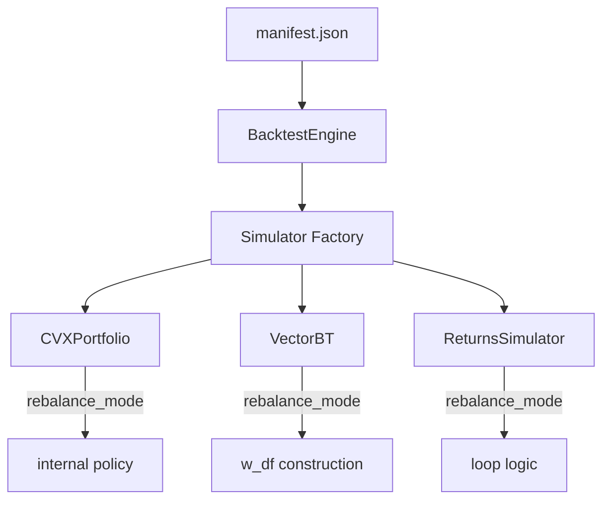

# Technical Design: Backtest Rebalance Modes

## 1. Data Flow



## 2. Implementation Strategies

### A. CVXPortfolio Alignment
CVXPortfolio naturally supports drift. To implement `window` mode without further trading:
1.  **Standard Implementation**: Use a custom `cvp.Policy` that only returns trades on the first timestamp of the window ($t_0$).
2.  **Logic**:
    ```python
    class WindowPolicy(cvp.Policy):
        def values_in_time(self, t, current_weights, **kwargs):
            if t == self.start_time:
                return self.target_weights - current_weights
            return pd.Series(0, index=current_weights.index)
    ```

### B. VectorBT Alignment
VectorBT's `from_orders` handles drift if the weight matrix is sparse.
1.  **`window` mode**:
    ```python
    w_df = pd.DataFrame(np.nan, index=returns.index, columns=returns.columns)
    w_df.iloc[0] = target_weights
    ```
2.  **`daily` mode**:
    ```python
    w_df = pd.DataFrame([target_weights] * len(returns), index=returns.index)
    ```

### C. ReturnsSimulator Alignment
The simplified returns logic must be extended for `daily` mode.
1.  **Current Logic (`window`)**:
    - `p_returns = returns @ target_weights`
    - `friction = turnover_at_t0 * total_rate`
2.  **Proposed Logic (`daily`)**:
    - Iterate daily:
        - `actual_w = prev_w * (1 + returns_t)` (normalized)
        - `trade_delta = target_w - actual_w`
        - `daily_friction = sum(|trade_delta|) * total_rate`
        - `p_return_t = (returns_t @ target_w) - daily_friction`

## 3. Drift Tolerance (Optional Feature)
When `feat_rebalance_tolerance` is enabled:
- The simulators must maintain an `actual_weights` series.
- At each step $t$, check: `if sum(abs(actual_w - target_w)) > limit`.
- If true, force a rebalance trade and charge friction.

## 4. Manifest Schema Updates
The following fields will be added to the `backtest` section of `configs/manifest.schema.json`:
- `feat_rebalance_mode`: enum ["window", "daily"]
- `feat_rebalance_tolerance`: boolean
- `rebalance_drift_limit`: number (min: 0, max: 1)
